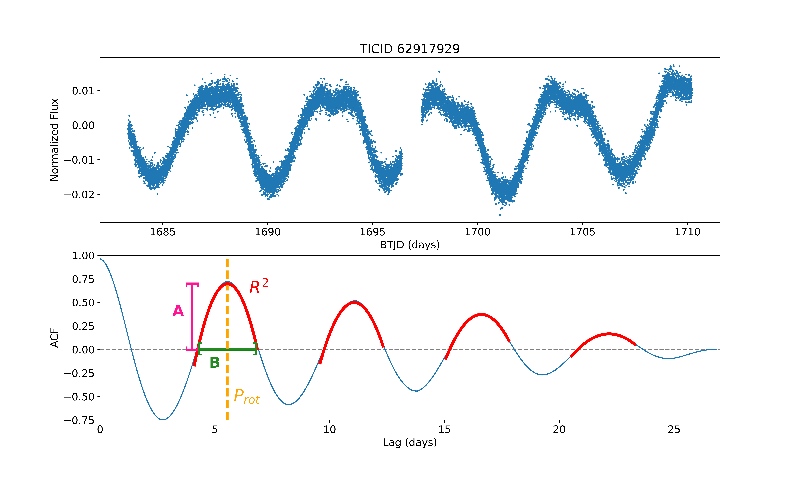

# SpinSpotter
SpinSpotter is an automated algorithm to calculate stellar rotation periods from high-cadence photometry.
SpinSpotter is currently still under construction! The code hosted here functions but is still being cleaned up for usability.

For an introduction to using SpinSpotter, check out the tutorial in github_tutorial.ipynb

